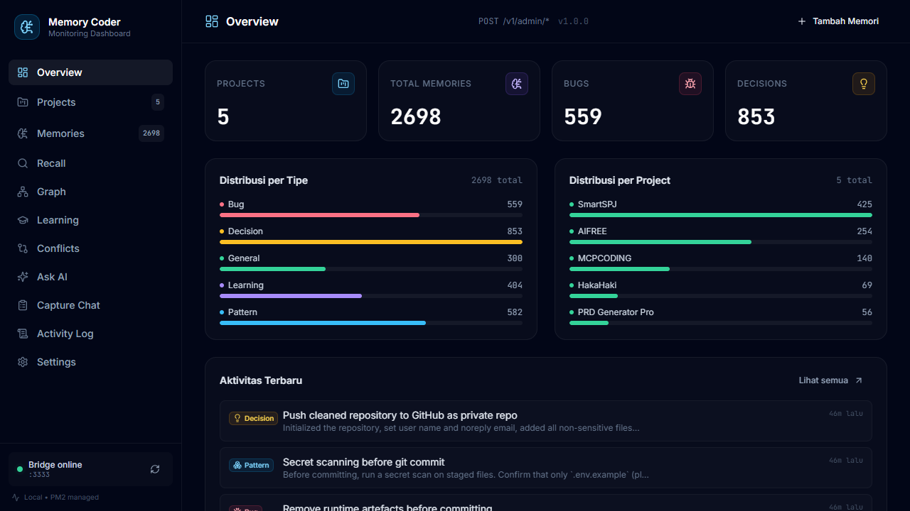
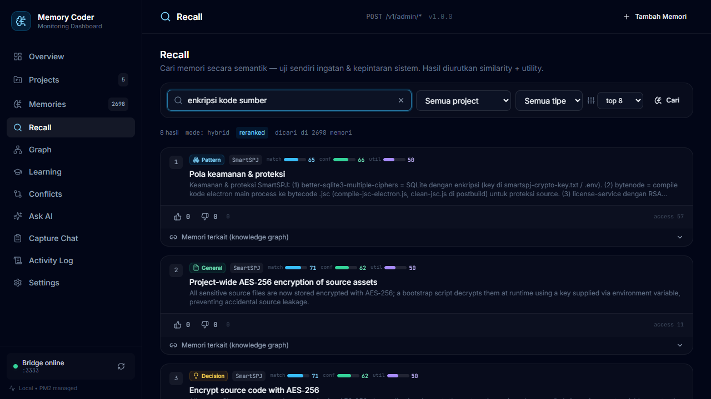
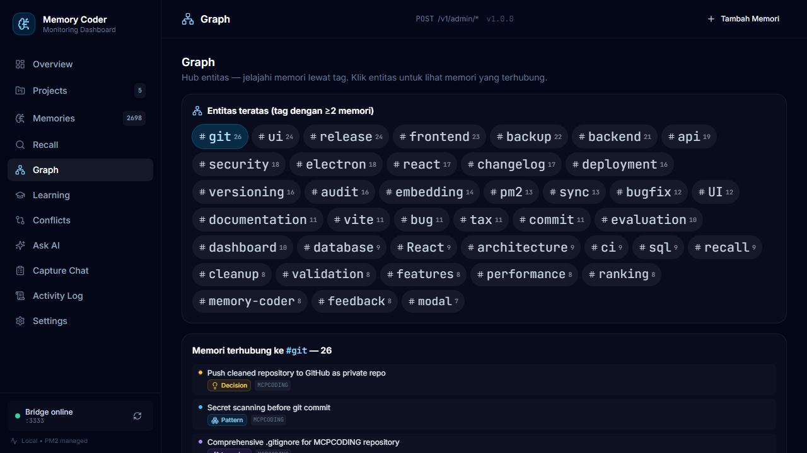
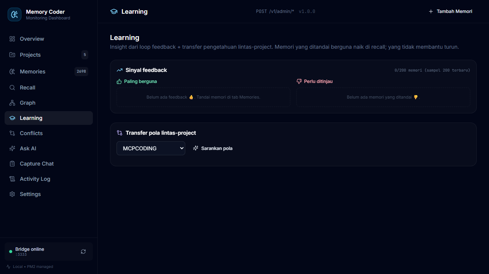
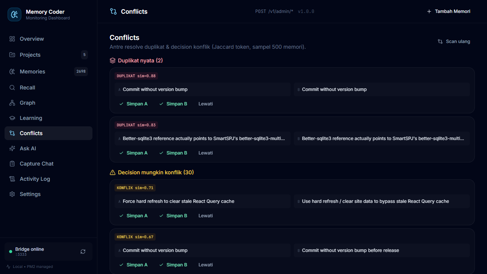
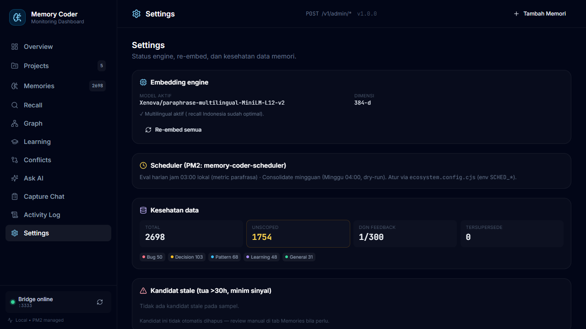

# Memory Coder

Persistent memory layer for AI coding agents — a local bridge that **stores, recalls, learns, and self-maintains** knowledge across agents, sessions, and projects. Multilingual semantic recall (ID/EN), a feedback-driven learning loop, a knowledge graph, conflict detection, and a full dashboard.



---

## Why

LLM agents forget. Memory Coder gives them a **single source of truth** that survives across sessions: decisions, bugs, patterns, and learnings are stored once and recalled semantically whenever needed. Crucially, it **learns** — memories rated useful rise in recall, misleading ones sink — and it **keeps itself tidy** (dedup, conflict detection, eval metrics) on a schedule.

## Features

| Capability | What it does |
|---|---|
| 🧠 **Multilingual semantic recall** | Hybrid vector (cosine) + BM25 + multi-signal rerank. Indonesian & English queries. `recall@10 ≈ 80%`. |
| 💡 **Feedback learning loop** | Mark a memory useful/not-useful → utility blends into rerank. The system gets smarter per interaction. |
| 🛡️ **Conflict guardian** | Storing a `decision` auto-detects near-duplicates (dedup) and updates (supersede/versioning). |
| 🕸️ **Knowledge graph** | Entity co-occurrence: find related memories + transfer patterns across projects. |
| 📉 **Decay & confidence** | Recency + utility → every recall result carries a `confidence` & `utility` score. |
| 🧹 **Self-maintenance** | Consolidate (dup/conflict cleanup), eval harness (recall@k/MRR), daily scheduler. |
| 🖥️ **Dashboard** | Recall playground, Graph, Learning insights, Conflicts queue, Settings — all 11 menus. |
| 🔌 **MCP + REST** | Use as an MCP server (Claude/Cursor) or hit the REST API directly. |

### Dashboard

| Recall (interactive search) | Graph (entity hub) |
|---|---|
|  |  |

| Learning (feedback insights + cross-project) | Conflicts (resolve queue) |
|---|---|
|  |  |

| Settings (engine + health + decay) |
|---|
|  |

## Architecture

```
memory-coder/
├── src/
│   ├── bridge/http.ts          # Express REST + static dashboard
│   ├── core/
│   │   ├── memory-service.ts   # remember / recall / feedback / conflict guardian
│   │   ├── rag-service.ts      # /ask (RAG Q&A over memories)
│   │   ├── graph-service.ts    # related + suggest-patterns (cached snapshot)
│   │   ├── admin-service.ts    # stats, conflicts, reembed, update-project
│   │   ├── conversation-service.ts  # /capture (LLM extraction)
│   │   └── git-indexer.ts      # index git commits → memories
│   ├── embeddings/             # xenova embedder + hybrid vector store + BM25 + reranker
│   ├── db/index.ts             # sql.js (SQLite WASM) CRUD
│   └── tools/index.ts          # MCP tool registry
├── dashboard/                  # React 18 + Vite + Tailwind UI
├── scripts/                    # maintenance: scheduler, consolidate, eval, backfill
└── data/memory.db              # your memories (gitignored — never committed)
```

## Quick start

### 1. Install
```bash
cd memory-coder
npm install
(cd dashboard && npm install && npm run build)   # build the dashboard UI
npm run build                                     # compile TS → dist/
```

### 2. Configure (optional)
```bash
cp .env.example .env          # set OPENROUTER_API_KEY for RAG/capture (optional)
```

### 3. Run
```bash
# bridge + dashboard on http://127.0.0.1:3333
MEMORY_CODER_MODE=bridge node dist/index.js
```

Or with PM2 (recommended, includes the maintenance scheduler):
```bash
pm2 start ../ecosystem.config.cjs
```

### 4. Use
- **Dashboard:** http://127.0.0.1:3333
- **MCP:** point your client at this server (see `claude_desktop_config.json`)
- **REST:** see API below

## API

Base `http://127.0.0.1:3333`. Writes/searches are POST JSON.

| Method | Path | Purpose |
|---|---|---|
| `GET` | `/health` | liveness |
| `POST` | `/v1/create-project` | register a project (run once before writing memories) |
| `POST` | `/v1/get-project-context` | project meta + recent memories |
| `POST` | `/v1/recall` | `{query,project_name?,limit?,candidate_pool?}` — semantic search w/ `confidence`/`utility` |
| `POST` | `/v1/remember` | `{content,type,project_name?,tags?,force?}` — store; decisions auto-dedup/supersede |
| `POST` | `/v1/feedback` | `{memory_id,useful}` — the learning loop |
| `GET` | `/v1/memory/:id/related` | knowledge-graph neighbours |
| `GET` | `/v1/suggest-patterns?project_name=X` | cross-project pattern transfer |
| `POST` | `/v1/admin/ask` | RAG Q&A (`{question,project_name?}`) |
| `GET/PUT/DELETE` | `/v1/admin/projects[/:id]` | list / edit / delete projects |
| `GET` | `/v1/admin/conflicts` | dup + decision-conflict pairs |
| `POST` | `/v1/admin/reembed` | re-compute all embeddings (after model swap) |
| `GET` | `/v1/admin/stats` · `/embed-status` | counts / active embedding model |

## Maintenance scripts (`memory-coder/scripts/`)

```bash
node scripts/scheduler.cjs                 # PM2 app: eval daily @03:00, consolidate weekly (dry-run)
node scripts/consolidate.cjs               # detect dup/conflicts; --apply --yes to remove dups
node scripts/eval-recall.cjs --seed        # seed golden set, then measure recall@k/MRR
node scripts/eval-recall.cjs --file golden-qa-paraphrase.json   # paraphrase benchmark
node scripts/backfill-scoping.cjs          # re-scope unscoped memories to their project
```

Eval trend is appended to `eval-trend.jsonl` (gitignored) — track recall quality over time.

## Tech stack

- **Backend:** TypeScript, Express 5, sql.js (SQLite WASM), zod
- **Embeddings:** `@xenova/transformers` — `paraphrase-multilingual-MiniLM-L12-v2` (384-dim). Configurable via `EMBEDDING_MODEL` (dimension-agnostic — mpnet 768-dim works when RAM allows).
- **Retrieval:** hybrid (bucketed ANN + BM25) + multi-signal reranker (similarity, overlap, utility, recency, importance)
- **LLM (RAG/capture):** OpenRouter (`openai/gpt-oss-120b:free` by default)
- **Dashboard:** React 18, Vite 5, Tailwind 3, lucide-react
- **Process:** PM2

## Notes

- **Memories are local & private** — `data/memory.db` is gitignored and never committed.
- **Scheduler runs on local time** (logs are UTC; `getHours()` is local, UTC+7).
- **PM2 env caveat:** changing `EMBEDDING_MODEL` in `ecosystem.config.cjs` requires `pm2 delete <app> && pm2 start ecosystem.config.cjs --only <app>` (`restart --update-env` does **not** re-read ecosystem env). After a model change, run `POST /v1/admin/reembed`.

## License

ISC
